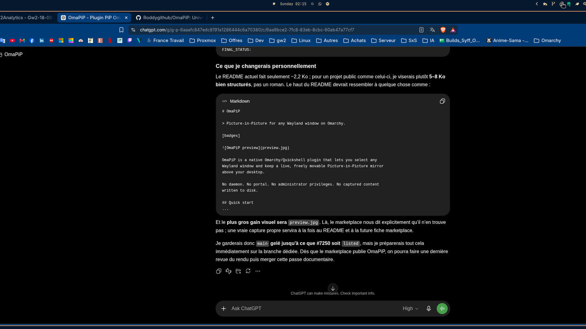
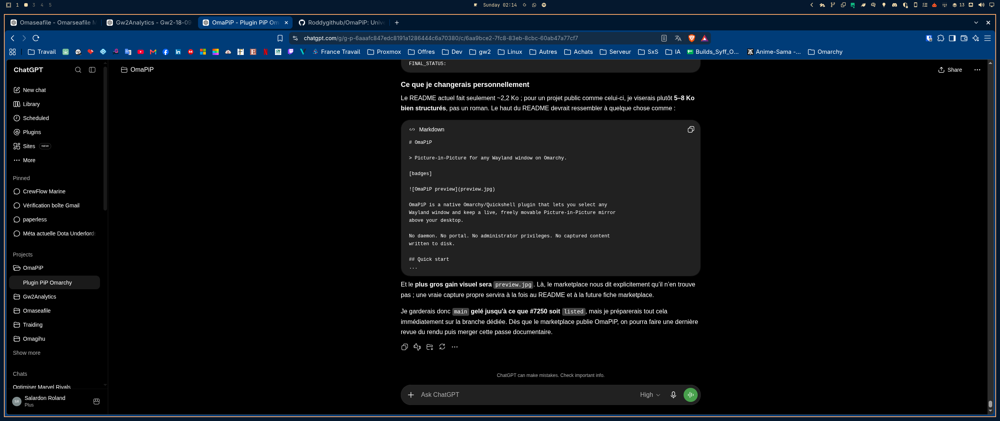
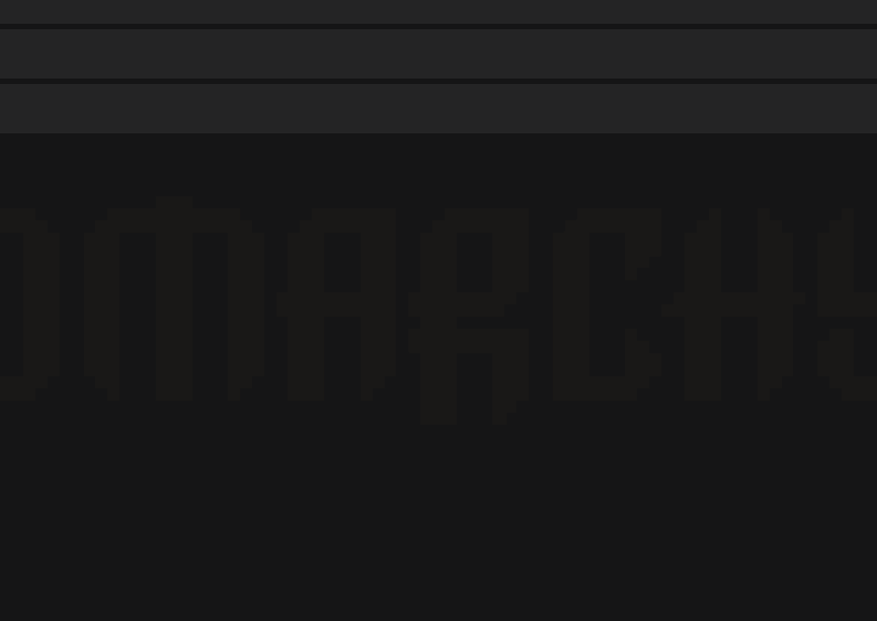

# OmaPiP

Picture-in-Picture for any Wayland window on Omarchy.



## Why OmaPiP?

Keep any window visible while you work — a video, a dashboard, a build log, a video call, or a reference document. The source window stays exactly where it is; OmaPiP mirrors it into a floating, always-on-top viewer that you can move, resize, and pin across workspaces.

## Features

- **Any selectable Wayland window** — pick from a live list of open windows
- **Native Omarchy bar widget** — one-click access from the bar
- **Floating always-visible viewer** — pinned across workspaces, raised above normal windows
- **Freeform move and resize** — drag anywhere to move; drag any edge or corner to resize (no aspect-ratio lock)
- **Fill / Fit / Stretch rendering** — three display modes, cycled from the toolbar
- **Change source without reopening** — *Choose* reopens the picker while capture continues
- **Exact source identity** — tracked by Hyprland address, not fragile titles
- **Explicit unavailable-source handling** — clear prompt when the source window is closed
- **No helper daemon** — runs entirely inside `omarchy-shell` as QML
- **No administrator privileges** — user-level only
- **No capture persistence** — pixels are never written to disk

## Quick Start

```bash
omarchy plugin add https://github.com/Roddygithub/OmaPiP.git --enable
```

1. Click the **** OmaPiP icon in the right bar section
2. Select a window from the picker
3. Drag the viewer to position it
4. Drag any edge or corner to resize freely
4. Click **Fill** to cycle Fill → Fit → Stretch
5. Click **Choose** to pick a different window
6. Click **Close** to hide the viewer (source window is unaffected)

## Screenshots

| Main PiP View | Source Picker |
|---------------|---------------|
|  |  |

## Controls

| Action | Result |
|--------|--------|
| Left-click + drag on viewer | Move viewer freely (native compositor move) |
| Drag any edge / corner | Resize freely (8 edges, native compositor resize) |
| Click **Fill** button | Cycle display mode: Fill → Fit → Stretch |
| Click **Choose** | Reopen source picker (capture continues) |
| Click **Close** | Close viewer only; source window unaffected |
| Right-click on viewer | Reopen source picker |
| Source window destroyed | Toolbar shows "Choose another window" |

## Display Modes

| Mode | Behavior |
|------|----------|
| **Fill** (default) | Preserve aspect ratio, crop to cover the entire viewer (like `background-size: cover`) |
| **Fit** | Preserve aspect ratio, show entire source; letterboxing may appear (like `background-size: contain`) |
| **Stretch** | Fill viewer exactly; distortion possible |

The viewer keeps its geometry when switching sources or display modes.

## Requirements

- Omarchy (Quattro or compatible plugin runtime)
- Hyprland
- Quickshell
- Wayland with `ScreencopyView` support (standard on modern Hyprland)

No minimum versions are enforced beyond what Omarchy itself requires.

## Privacy & Security

- No network access from OmaPiP itself
- No authentication, secrets, or credentials
- No administrator privileges required
- No external helper, daemon, or portal (PipeWire, xdg-desktop-portal)
- Captured pixels are **not persisted to disk** — they exist only in GPU memory during the live mirror
- Selected Hyprland address is session state only; never written to config files

See [SECURITY.md](SECURITY.md) for the vulnerability reporting policy and security boundaries.

## Install / Update / Remove

```bash
# Install and enable
omarchy plugin add https://github.com/Roddygithub/OmaPiP.git --enable

# Update (when a new release is published)
omarchy plugin update io.github.roddygithub.omapip --yes

# Disable temporarily
omarchy plugin disable io.github.roddygithub.omapip

# Remove completely
omarchy plugin remove io.github.roddygithub.omapip --yes
```

## CLI / Advanced Use

```bash
# Summon via shell (secondary path)
omarchy-shell shell summon io.github.roddygithub.omapip

# Inspect internal state (JSON)
omarchy-shell shell call io.github.roddygithub.omapip status ''

# List available sources (JSON)
omarchy-shell shell call io.github.roddygithub.omapip sources ''

# Select a specific Hyprland address
omarchy-shell shell call io.github.roddygithub.omapip select '0x123456'

# Reopen picker
omarchy-shell shell call io.github.roddygithub.omapip chooseAnother ''

# Programmatic placement
omarchy-shell shell call io.github.roddygithub.omapip placeBottomLeft ''
omarchy-shell shell call io.github.roddygithub.omapip placeBottomRight ''

# Cycle display mode
omarchy-shell shell call io.github.roddygithub.omapip cycleDisplayMode ''
```

## Known Limitations

- Multi-monitor behavior has not yet received full validation
- Mixed-DPI behavior has not yet received full validation

## Compatibility & Status

| Item | Status |
|------|--------|
| Current release | v0.1.2 |
| Tests | 91 automated display/behavior tests |
| GitHub Actions CI | Enabled (manifest + display tests) |
| Marketplace | Submission validated; listing review pending |

## Project Structure

```
BarWidget.qml       # Bar widget entry point (Ui.BarWidget + IPC)
Panel.qml           # Picker + viewer logic (FloatingWindow, ScreencopyView)
manifest.json       # Omarchy plugin manifest
tests/
  test_display.js   # 91 unit tests for geometry/display logic
docs/
  assets/           # Screenshots and preview image
  *.md              # Internal research docs (feasibility, ecosystem, validation)
SECURITY.md         # Security policy and reporting
LICENSE             # MIT
```

## Development

```bash
# Run display tests
node tests/test_display.js

# Validate plugin manifest (on Omarchy)
omarchy plugin validate .
```

## Contributing

1. Fork and create a feature branch
2. Make focused changes with clear commit messages
3. Ensure `node tests/test_display.js` passes (91/91)
4. Run `omarchy plugin validate .` locally if on Omarchy
5. Open a PR against `main`

No heavy framework, no boilerplate — small, reviewable diffs preferred.

## Issues

- **Bug reports**: Include Omarchy version, Hyprland version, Quickshell version, steps to reproduce, expected vs actual behavior, logs, and whether multi-monitor is in use
- **Feature requests**: Describe the problem, proposed behavior, and any alternatives considered

Issue templates are available in `.github/ISSUE_TEMPLATE/`.

## License

MIT — see [LICENSE](LICENSE).

---

*OmaPiP is a native Omarchy/Quickshell plugin. It is not affiliated with the Hyprland or Omarchy projects beyond using their public APIs.*